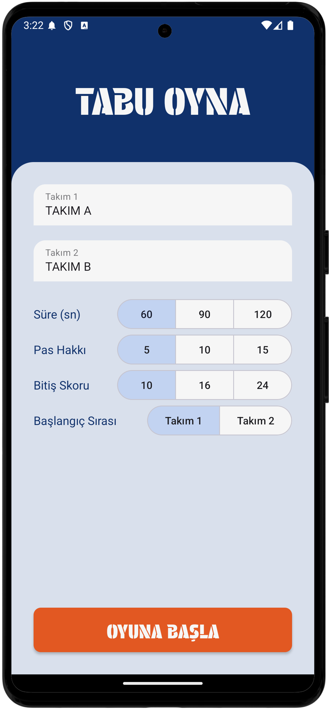
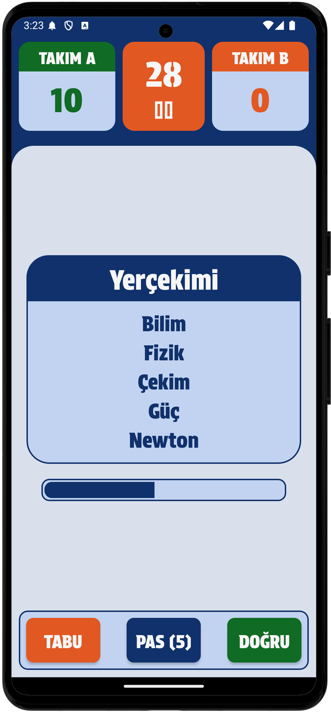

# Taboo Word Game

Taboo Word Game is a fun Android application you can play with your friends or family. The app offers a modern design and user-friendly interface. In the game, you must describe a specific word to your team without using certain related words.

## Features
- View word cards
- Scoring system
- Timer integration
- Customize team names
- Persist data locally

## Architecture
The app follows the **MVVM (Model-View-ViewModel)** architectural pattern, ensuring better code maintainability and testability.

- **Model**: Represents the data layer, managing data source operations.
- **View**: Displays the user interface and interacts with the user.
- **ViewModel**: Serves as a bridge between Model and View, providing the necessary data and handling user interactions.

## Technologies and Libraries Used

- **Kotlin**: Programming language for Android development
- **MVVM Architecture**: Model-View-ViewModel structure
- **Room**: Local database management
- **LiveData** and **ViewModel**: Reactive data flow and UI state management
- **DataStore Preferences**: Persistent data storage
- **Coroutines**: For asynchronous operations
- **Material Design**: Modern and aesthetic UI design

## Screenshots

| Home Screen                | Game Screen                |
|----------------------------|----------------------------|
|  |  |

## Setup

1. Clone this repository:
    ```bash
    git clone https://github.com/azadkiziltas/Tabu.git
    ```
2. Open the project in Android Studio.
3. Sync Gradle and run the app on a device.

## License

This project is licensed under the MIT License. See the [LICENSE](LICENSE) file for more details.

---

If you have any questions or suggestions, feel free to open an issue or contact me.

